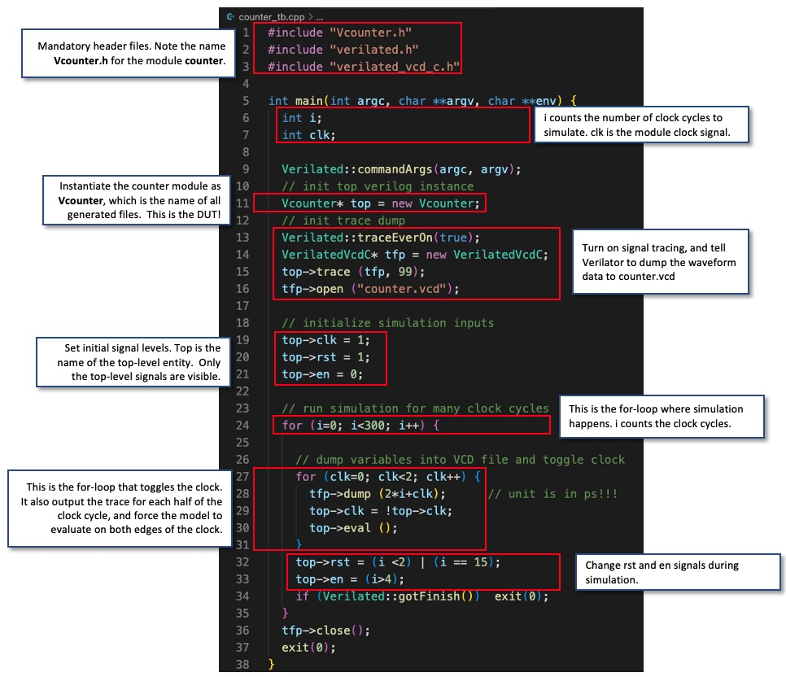

# Task 1

## Overview

In Task 1, our main aims were to experiment with the functionality of SystemVerilog and GTKwave through creating a counter circuit with a reset function

## Process

### Counter.sv
This was the top SystemVerilog file. It counts on the positive edge of clk if enable is ‘1’. It is synchronously reset to 0 if rst is asserted

```verilog
module counter #(
    parameter WIDTH = 8
)(

    input  logic             clk,
    input  logic             rst,
    input  logic             en,
    output logic [WIDTH-1:0] count
);

always_ff @ (posedge clk)
    if (rst) count <= {WIDTH{1'b0}};
    else     count <= count + {{WIDTH-1{1'b0}}, en};

endmodule
```

Here we note some basics:
1) The file name and the module name must be the same.
2) The number of bits in the counter is specified with the parameter WIDTH. It is currently set to 8-bit.
3) The always_ff @ (posedge clk) is the way that one specifies a clocked circuit.
4) ‘<=’ in line 12 and 13 are non-block assignments which should be used within an always_ff block.
5) {WIDTH{1’b0}} in line 12 uses the concatenation operator { } to form WIDTH bits of ‘0’. 
6) count <= count + {{WIDTH-1{1'b0}}, en} in line 13 creates a WIDTH bit number with the first WIDTH-1 bits as 0 and the final bit equal to en. This adds by 1 if en is 1 (active high)

---

### Counter_tb.cpp
This is the testbench (hence _tb) which is used to test whether our SV file works by testing it with various input signals and reading the outputs.

Below explains the various lines (all quite self explanatory)



---

### Compiling

We made a shell script to handle compiling and running the executable

```sh
# cleanup
rm -rf obj_dir
rm -f counter.vcd

# run Verilator to translate Verilog into C++, including C++ testbench
verilator -Wall --cc --trace counter.sv --exe counter_tb.cpp

# build C++ project via make automatically generated by Verilator
make -j -C obj_dir/ -f Vcounter.mk Vcounter

# run executable simulation file
obj_dir/Vcounter
```

## Test ourselves

1) Modify the testbench so that you stop counting for 3 cycles once the counter reaches 0x9, and then resume counting. You may also need to change the stimulus for rst.

```cpp
int prev = 0;

for (i = 0; i < 300; i++) {

    for (clk = 0; clk < 2; clk++) {
        tfp->dump (2*i + clk);
        top->clk = !top->clk;
        top->eval ();
    }

    if(top->count == 0b00001001){
        if(prev == 0){
            prev = i;
            top->en = 0;
        }
        else if(i == prev+2){
            top->en = 1;
        }
    }

    if (Verilated::gotFinish()) exit(0);
}
```

2) The current counter has a synchronous reset. To implement asynchronous reset, you can change line 11 of counter.sv to detect change in rst signal.

```sv
always_ff @ (posedge clk or posedge rst) // now asynchronous reset
```

---


