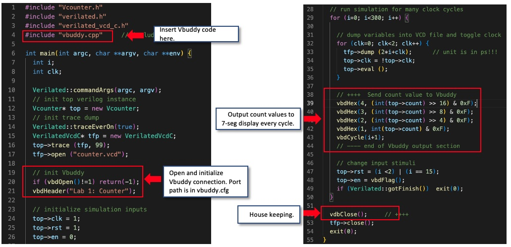

# Task 2

## Overview

In Task 2, our main aims were to link the Vbuddy up with the testbench and visualise the counter on the 7-segment display

## Process

### Edit Counter_tb.cpp

Edits are very self explanatory, adds controls for Vbuddy to display value on 7 segment



### Exploring flag

Used the rotry encoder as a button to toggle an internal switch, hooking this up to the enabled value of the counter allows us to stop and start the counter ourselves

```cpp
top->en = vbdFlag();
```

### Plotting on Vbuddy

Another feature is their plot function.

```cpp
vbdPlot(int(top->count), 0, 255);
```

## Test yourself

1) Modify your counter and testbench files so that the en signal controls the direction of counting: ‘1’ for up and ‘0’ for down, via the vbdFlag() function.

This required just changing the coutner.sv file to this:

```verilog
always_ff @ (posedge clk or posedge rst) // now asynchronous reset
    if (rst) count <= {WIDTH{1'b0}};
    else if(en)   count <= count + {{WIDTH-1{1'b0}}, 1};
    else count <= count + {{WIDTH{1'b1}}};
endmodule
```

Now it toggles between up and down when pressing the switch


